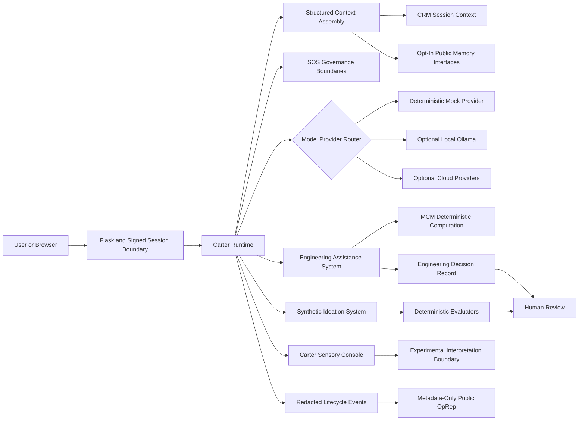

<!--
SPDX-License-Identifier: AGPL-3.0-only
Copyright (C) 2023-2026 Michael D. Lewis, doing business as Synthetic OS Labs
-->

# Carter Synthetic OS

**A governed compound AI research platform built around one principle: probabilistic AI should not govern or validate itself.**

Carter Synthetic OS combines language-model reasoning with bounded memory, deterministic computation, schema validation, governance gates, operational traceability, and required human review.

Its public subsystems include:

* **Synthetic Operating System (SOS)** — orchestration, governance, memory, provider, and computation boundaries
* **Engineering Assistance System (EAS)** — governed engineering decision support
* **Synthetic Ideation System (SIS)** — structured and evaluated technical ideation
* **Carter Sensory Console (CSC)** — bounded speech, attention, interpretation, and sensory-state research

**Version:** 0.1.0 — Initial Public Research Release
**License:** GNU Affero General Public License v3.0 only (`AGPL-3.0-only`)
**Creator:** Michael D. Lewis, founder of Synthetic OS Labs
**Canonical source:** https://github.com/mdlewis365/carter-synthetic-os

> **Current opportunity:** I am seeking AI engineering positions, technical collaborators, engineering pilot partners, and conversations concerning research or early-stage funding.

[Quick Start](#quick-start) · [Architecture](#architecture) · [Reproducible Evidence](#reproducible-evidence) · [Documentation](#documentation)

---

## Project Status

This repository is the **Initial Public Research Release and reference runtime** of Carter/Synthetic OS.

It is a runnable, package-oriented public implementation derived from the architecture, deterministic engineering components, subsystem contracts, and operating concepts of the private Carter system.

The private Carter/Synthetic OS codebase remains the canonical operational and continuing R&D implementation. This public runtime is designed for:

* inspection;
* reproducibility;
* research;
* demonstration;
* external testing;
* contribution;
* technical evaluation by employers, collaborators, and potential supporters.

It is not represented as a complete copy of the private Carter deployment.

The default mock experience and standard test suite require:

* no private data;
* no model weights;
* no paid API;
* no provider credentials;
* no network access.

This release is not a production deployment recommendation, professional certification, scientific validation, or unrestricted autonomous system.

---

## Why Carter Exists

Language models are powerful probabilistic reasoners, but their outputs may be incomplete, inconsistent, unsupported, or wrong.

Carter is an exploration of a different system design:

> **Use probabilistic models to propose, interpret, and reason—but use explicit software boundaries to govern, validate, compute, record, and escalate.**

The architecture separates several responsibilities that are often combined inside a single prompt or agent loop:

* language generation;
* memory retrieval;
* deterministic calculation;
* schema validation;
* governance;
* tool authorization;
* lifecycle observation;
* human review.

The objective is not to eliminate uncertainty. It is to make uncertainty, authority, and failure states more visible.

---

## What This Repository Demonstrates

Carter Synthetic OS provides inspectable proof of work across:

* Python application and package architecture;
* Flask APIs and Server-Sent Events;
* local and cloud language-model provider boundaries;
* deterministic mock execution;
* bounded request and response contracts;
* session-scoped memory;
* optional persistence interfaces;
* deterministic engineering computation;
* engineering units and constraint handling;
* governance and human-review states;
* structured ideation workflows;
* sensory-session isolation;
* speech transcription and synthesis boundaries;
* security-focused configuration;
* reproducible execution evidence;
* unit, integration, and smoke testing;
* packaging, CI, and public-release documentation.

The repository is intended to show not merely an AI prompt, but a compound system in which probabilistic and deterministic components have distinct responsibilities.

---

## Architecture



The boundary between probabilistic output and deterministic processing is explicit.

Model providers may propose text or structured candidates. Schemas, the experimental SAL v0 boundary, MCM, governance gates, and record-generation components operate deterministically on the inputs they receive.

The public runtime does not claim that deterministic processing makes language-model output factually correct. It establishes only the conditions explicitly implemented in code.

See:

* [Architecture](docs/ARCHITECTURE.md)
* [Data Flow](docs/DATA_FLOW.md)
* [Governance](docs/GOVERNANCE.md)
* [Threat Model](docs/THREAT_MODEL.md)

---

## Why Carter Is Different

### Governance is externalized

Language-model output is not automatically accepted as system truth, memory, authority, or permission to act.

### Computation is separated from generation

The Mathematical and Computational Module performs deterministic calculations, unit handling, constraint evaluation, sensitivity processing, diagnostics, and result classification outside the language model.

### Failure states remain visible

The system can return bounded failure, uncertainty, unsupported input, schema rejection, or required human review rather than forcing a successful-looking answer.

### Memory is bounded and explicit

The public runtime uses session-scoped memory by default. Persistent memory is optional and disabled unless deliberately configured.

### Specialized systems share governed interfaces

EAS, SIS, and CSC operate through explicit subsystem boundaries rather than unrelated prompt chains.

### Evidence can be reproduced

The repository contains deterministic execution artifacts, metadata, and hashes that can be regenerated without a paid provider or private data.

---

## Public Subsystems

## Synthetic Operating System

Synthetic OS provides the public orchestration and governance foundation for Carter.

The public SOS runtime includes:

* normalized request contracts;
* temporal and session anchors;
* bounded context assembly;
* provider-neutral model interfaces;
* provider routing;
* session CRM;
* opt-in AMS-style memory interfaces;
* deterministic DIM ingestion and deduplication;
* governance gates;
* default-deny tool boundaries;
* lifecycle-event recording;
* metadata-only public operational reports;
* MCM deterministic computation;
* an experimental SAL v0 structural-output boundary.

### Experimental SAL v0

The public `sos.sal` module is a new 0.1.0 research component.

Its current responsibility is narrow:

* accept bounded JSON-like provider output;
* reject malformed or unsafe structural values;
* require an object root;
* return a controlled success or failure envelope.

It does **not** currently implement complete semantic adjudication such as:

* intent alignment;
* domain truth assessment;
* assumption auditing;
* memory-authority adjudication;
* confidence correction;
* counter-framing;
* semantic factual validation.

It should therefore be understood as an **experimental structural-output boundary**, not the completed Semantic Adjudication Layer envisioned for the broader Carter architecture.

See:

* [Synthetic OS](docs/SOS.md)
* [SAL](docs/SAL.md)
* [Memory](docs/MEMORY.md)
* [Governance](docs/GOVERNANCE.md)

---

## Engineering Assistance System

EAS is a governed engineering decision-support workflow.

The public implementation includes:

* engineering-mode normalization;
* engineering-pack discovery and selection;
* structured stage-one plans;
* schema validation;
* deterministic mock planning;
* optional provider-generated stage-one proposals;
* MCM request execution;
* unit and constraint processing;
* sensitivity handling;
* Engineering Decision Records;
* governance classification;
* bounded final advisories;
* mandatory human-review status.

The public EAS runtime preserves the directly derived deterministic engineering kernel while presenting a simplified research workflow around it.

The private Carter implementation contains additional provider, upload, asynchronous-job, recovery, and model-generated reporting behavior that is not reproduced here.

> **EAS does not replace licensed engineering judgment, code-compliance review, hazard analysis, safety analysis, physical testing, or professional approval. Every public EAS result requires qualified human review.**

See [Engineering Assistance System](docs/EAS.md).

---

## Synthetic Ideation System

SIS is a structured technical-ideation and hypothesis-evaluation workflow.

The public implementation includes:

* scientist-input normalization;
* bounded invention modes;
* structured candidate generation;
* deterministic mock candidates;
* provider-candidate normalization;
* rejection-boundary checks;
* invariant-claim checks;
* novelty and risk heuristics;
* evaluator aggregation;
* optional MCM feasibility input;
* governance of final candidate output.

The public evaluator workflow is an experimental research composition. It is not represented as identical to the private SIS implementation or as proof that a proposed concept is novel, feasible, safe, or patentable.

> **SIS outputs are hypotheses and candidates. They require independent technical validation, prior-art research, patent analysis, safety assessment, and experimental confirmation.**

See [Synthetic Ideation System](docs/SIS.md).

---

## Carter Sensory Console

CSC explores bounded sensory intake and interpretation for Carter.

The public implementation includes:

* explicit hearing activation;
* explicit camera-preview state;
* browser audio capture;
* PCM16 WAV conversion and validation;
* transcription-provider boundaries;
* wake-name and attention classification;
* bounded rolling transcript buffers;
* session-scoped sensory state;
* optional local Ollama interpretation;
* configurable ElevenLabs speech;
* an experimental, non-action-authorizing interpretation boundary.

The public CSC interpreter cannot independently authorize:

* a response;
* a memory write;
* an external action;
* tool execution.

Microphone and camera permissions remain disabled until direct user action.

Camera frames remain in the browser and are not accepted by the server. Raw audio is processed within the configured transcription boundary and is not durably retained by the public runtime.

See [Carter Sensory Console](docs/CSC.md).

---

## What This Release Is—and Is Not

| This release is                                           | This release is not                         |
| --------------------------------------------------------- | ------------------------------------------- |
| A runnable public research runtime                        | A complete copy of private Carter           |
| A reference implementation of the Carter/SOS architecture | A production deployment                     |
| A deterministic mock-first demonstration                  | A claim that mock mode is an LLM            |
| A governed compound AI software project                   | An unrestricted autonomous agent            |
| A public engineering and research artifact                | Professional certification                  |
| Evidence of system design and implementation              | Proof of scientific correctness             |
| Open-source software under AGPL-3.0-only                  | A warranty of safety or fitness             |
| A platform for research and contribution                  | A claim of consciousness, sentience, or AGI |

Carter is not represented as conscious, sentient, independently autonomous, professionally licensed, scientifically validated, or capable of guaranteeing factual correctness.

Language-model output remains probabilistic.

Deterministic checks establish only the conditions encoded in software. They do not establish real-world safety, completeness, legality, or professional approval.

---

## Quick Start

### Requirements

* Python 3.11 or newer
* A modern browser
* No credentials for default mock mode
* Ollama only for optional local-model mode
* Provider credentials only for explicitly selected cloud modes

### Windows PowerShell

```powershell
git clone https://github.com/mdlewis365/carter-synthetic-os.git
cd carter-synthetic-os

python -m venv .venv
.\.venv\Scripts\Activate.ps1

python -m pip install -e .
python -m carter.cli
```

### Unix-Like Systems

```bash
git clone https://github.com/mdlewis365/carter-synthetic-os.git
cd carter-synthetic-os

python3 -m venv .venv
. .venv/bin/activate

python -m pip install -e .
python -m carter.cli
```

Open:

```text
http://127.0.0.1:5000
```

The default server:

* binds to loopback;
* uses the deterministic mock provider;
* disables debug mode;
* disables persistent memory;
* disables sensory retention;
* requires no API key.

Convenience scripts are also provided:

```powershell
.\scripts\setup.ps1
.\scripts\run_demo.ps1
```

```bash
./scripts/setup.sh
./scripts/run_demo.sh
```

---

## Mock Demonstration

Mock mode is the default public experience.

It is an explicitly labeled deterministic fixture provider—not a language model.

Mock mode exercises:

* request normalization;
* context assembly;
* provider routing;
* governance;
* response streaming;
* EAS computation;
* SIS evaluation;
* CSC attention and interpretation boundaries;
* execution metadata.

It does so without:

* private data;
* paid APIs;
* model downloads;
* external network calls.

Run individual examples after installation:

```bash
python -m examples.basic_chat.run
python -m examples.eas.run
python -m examples.sis.run
python -m examples.csc.run
```

---

## Reproducible Evidence

The included evidence case uses a synthetic engineering scenario.

It records:

1. user input;
2. normalized request;
3. structured stage-one plan;
4. schema validation;
5. deterministic MCM output;
6. governance result;
7. bounded final response;
8. execution metadata;
9. SHA-256 artifact hashes;
10. a continuous execution trace.

Regenerate the evidence:

```bash
python -m examples.evidence.run_case
```

Verify the checked-in evidence:

```bash
python -m examples.evidence.run_case --check
```

The structured plan uses the same public contract expected from a probabilistic stage-one proposal, but the evidence case uses the deterministic mock provider.

The manifest explicitly records that no language model, paid API, or provider network was used.

---

## Optional Model Providers

The public runtime supports:

* deterministic mock mode;
* local Ollama;
* OpenAI;
* Anthropic;
* Google.

Provider packages are optional. Standard installation and testing do not require them.

### Local Ollama

```bash
ollama serve
export CARTER_PROVIDER=ollama
export OLLAMA_MODEL=your-local-model
python -m carter.cli
```

PowerShell:

```powershell
ollama serve
$env:CARTER_PROVIDER = "ollama"
$env:OLLAMA_MODEL = "your-local-model"
python -m carter.cli
```

Ollama defaults to:

```text
http://127.0.0.1:11434
```

Remote Ollama endpoints require explicit opt-in. URLs containing embedded credentials, query strings, or fragments are rejected.

### Optional Cloud Providers

Install only the selected provider extra:

```bash
python -m pip install -e ".[openai]"
python -m pip install -e ".[anthropic]"
python -m pip install -e ".[google]"
```

Provider credentials are read from environment variables and are not required by mock mode, standard tests, or evidence generation.

See [Model Providers](docs/MODEL_PROVIDERS.md).

---

## Security and Privacy Defaults

The public runtime is designed to start conservatively.

Default boundaries include:

* loopback-only server binding;
* debug mode disabled;
* signed, HTTP-only, SameSite session cookies;
* header-based CSRF protection;
* bounded request payloads;
* restrictive browser security headers;
* no default cross-origin API policy;
* session-owned jobs;
* process-local CRM and CSC buffers;
* persistent memory disabled;
* raw sensory retention disabled;
* camera frames kept in the browser;
* provider access disabled until explicitly configured;
* redaction of content-bearing lifecycle fields;
* environment-variable secrets;
* no private Carter memories, conversations, jobs, recordings, credentials, or databases.

This release does not claim production readiness.

Any network deployment must add and review:

* TLS;
* secure-cookie settings;
* maintained WSGI hosting;
* reverse-proxy limits;
* durable secret management;
* monitoring;
* retention policy;
* provider data-processing terms;
* authentication and authorization;
* AGPL source-availability obligations.

See:

* [Privacy](PRIVACY.md)
* [Security Policy](SECURITY.md)
* [Threat Model](docs/THREAT_MODEL.md)
* [Deployment](docs/DEPLOYMENT.md)

---

## Testing

Install development dependencies:

```bash
python -m pip install -e ".[dev]"
```

Run the standard offline test suite:

```bash
python -m pytest -m "not local_model and not cloud_provider and not slow"
```

Or use:

```powershell
.\scripts\run_tests.ps1
```

```bash
./scripts/run_tests.sh
```

The public suite includes:

* unit tests;
* integration tests;
* smoke tests;
* mocked provider tests;
* governance tests;
* memory-isolation tests;
* EAS and SIS workflow tests;
* CSC boundary tests;
* hostile and resource-bounded MCM inputs.

Local-model, cloud-provider, sensory-hardware, and slow tests are opt-in.

See:

* [Testing](docs/TESTING.md)
* [Public Release Report](PUBLIC_RELEASE_REPORT.md)

---

## Known Limitations

* The private Carter/Synthetic OS repository remains the canonical operational implementation.
* The public runtime is not behaviorally identical to private Carter.
* Mock mode is not a language model.
* No local or cloud model is scientifically validated by this release.
* Model output can be wrong, incomplete, biased, or unsafe.
* Public AMS and CRM are simplified and do not reproduce private Carter continuity.
* Public DIM is a new bounded 0.1.0 implementation.
* Public SAL is an experimental structural-output boundary, not complete semantic adjudication.
* Public SQLite support is newly designed and is not a migration of the private AMS database.
* The public EAS advisory differs from the private model-generated final-report stage.
* The public SIS evaluator workflow is experimental and not a direct port of the complete private workflow.
* CSC interpretation is experimental and cannot authorize responses, memory writes, tools, or actions.
* Camera support is browser-preview state only.
* Standard tests do not contact provider networks or exercise physical sensory hardware.
* Deterministic validation covers only encoded schemas, equations, units, constraints, and rules.
* Independent technical, security, dependency, patent, ownership, and licensing review remains necessary.

See:

* [Known Limitations](KNOWN_LIMITATIONS.md)
* [Research Status](docs/RESEARCH_STATUS.md)
* [Roadmap](ROADMAP.md)

---

## Repository Layout

```text
src/
  carter/       Flask application, CLI, runtime integration, and public UI
  sos/          orchestration, governance, memory, providers, MCM, logging, SAL
  eas/          engineering workflows, packs, records, governance, fixtures
  sis/          ideation workflows, schemas, candidates, evaluators
  csc/          sensory state, WAV, transcription, interpretation, and TTS
  shared/       configuration, redaction, and version utilities

tests/
  unit/         component-level tests
  integration/  workflow and API integration tests
  smoke/        secret-free end-to-end mock execution

examples/
  basic_chat/   mock Carter example
  eas/          deterministic EAS example
  sis/          structured SIS example
  csc/          sensory-state example
  evidence/     reproducible engineering evidence pipeline

docs/           architecture, subsystem, security, deployment, and research docs
scripts/        setup, demo, and offline test commands
```

Runtime templates and static resources are packaged beneath `src/carter`.

---

## Documentation

### Architecture and Operation

* [Architecture](docs/ARCHITECTURE.md)
* [Data Flow](docs/DATA_FLOW.md)
* [Synthetic OS](docs/SOS.md)
* [Memory](docs/MEMORY.md)
* [Governance](docs/GOVERNANCE.md)
* [Model Providers](docs/MODEL_PROVIDERS.md)
* [Deployment](docs/DEPLOYMENT.md)

### Subsystems

* [Semantic Adjudication Layer](docs/SAL.md)
* [Engineering Assistance System](docs/EAS.md)
* [Synthetic Ideation System](docs/SIS.md)
* [Carter Sensory Console](docs/CSC.md)

### Validation and Safety

* [Testing](docs/TESTING.md)
* [Research Status](docs/RESEARCH_STATUS.md)
* [Technical Limitations](docs/LIMITATIONS.md)
* [Known Limitations](KNOWN_LIMITATIONS.md)
* [Threat Model](docs/THREAT_MODEL.md)
* [Privacy](PRIVACY.md)
* [Security](SECURITY.md)

### Release and Participation

* [Public Release Report](PUBLIC_RELEASE_REPORT.md)
* [Release Notes](RELEASE_NOTES.md)
* [Roadmap](ROADMAP.md)
* [Contributing](CONTRIBUTING.md)
* [Code of Conduct](CODE_OF_CONDUCT.md)

---

## Employment, Pilots, Collaboration, and Funding

Carter Synthetic OS represents several years of independent AI systems engineering and research by Michael D. Lewis through Synthetic OS Labs.

The project demonstrates experience in:

* AI application architecture;
* agent and compound-system design;
* local and cloud model integration;
* deterministic validation;
* engineering computation;
* AI governance;
* persistent and session memory;
* schema-driven workflows;
* Flask and SSE application development;
* security-conscious public packaging;
* test and evidence design;
* technical documentation;
* end-to-end research system development.

Michael is currently interested in:

* AI Engineer positions;
* Software Engineer roles involving AI systems;
* Applied AI and agentic-system engineering;
* governed or safety-conscious AI development;
* engineering-software pilot partnerships;
* technical collaboration;
* research support;
* grants, sponsorship, and early-stage funding conversations.

For employment, pilot, collaboration, or funding inquiries, contact Michael through the GitHub profile associated with this repository.

---

## Contributing

Contributions are welcome when they preserve:

* explicit probabilistic and deterministic boundaries;
* bounded inputs and outputs;
* human-review requirements;
* privacy-safe defaults;
* reproducibility;
* honest capability claims;
* failure transparency.

Read:

* [Contributing](CONTRIBUTING.md)
* [Code of Conduct](CODE_OF_CONDUCT.md)
* [Security Policy](SECURITY.md)

Accepted contributions are distributed under `AGPL-3.0-only`.

No contributor license agreement is currently imposed by this repository.

---

## License and Notices

First-party software is offered under the GNU Affero General Public License version 3 only.

See:

* [LICENSE](LICENSE)
* [Copyright](COPYRIGHT.md)
* [Third-Party Notices](THIRD_PARTY_NOTICES.md)
* [License Compatibility Report](LICENSE_COMPATIBILITY_REPORT.md)
* [Trademarks](TRADEMARKS.md)

Operators who modify this AGPL-covered program and provide access to it over a network must review their corresponding-source obligations.

This statement is not legal advice.

---

## Author and Attribution

**Michael D. Lewis**
Founder, Synthetic OS Labs
Creator and originating architect of Carter and Synthetic OS

Copyright (C) 2023-2026 Michael D. Lewis, doing business as Synthetic OS Labs.

Project names include:

* Carter
* Carter Synthetic OS
* Synthetic OS
* Synthetic Operating System
* Engineering Assistance System
* Synthetic Ideation System
* Carter Sensory Console

Third-party dependencies, licenses, and exceptions are documented separately.