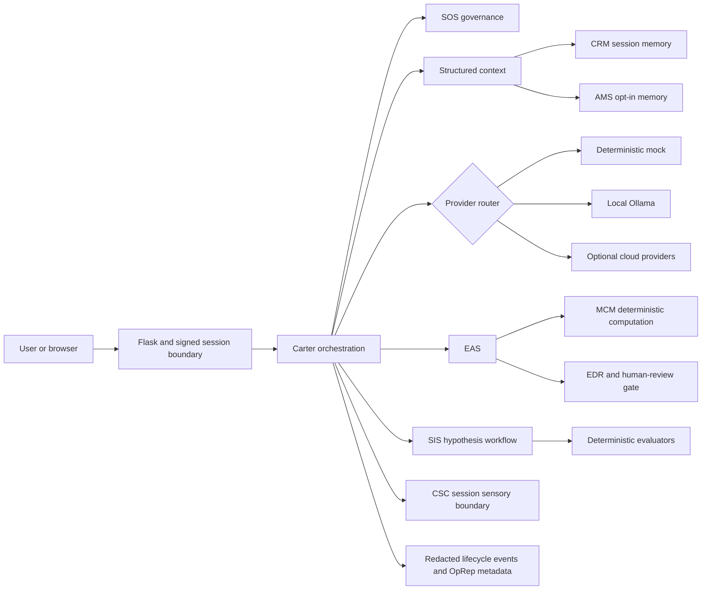

<!--
SPDX-License-Identifier: AGPL-3.0-only
Copyright (C) 2023-2026 Michael D. Lewis, doing business as Synthetic OS Labs
-->

# Carter Synthetic OS

Carter Synthetic OS is a governed compound AI expert system and research
platform. It orchestrates probabilistic language-model providers with
deterministic memory, computation, validation, governance, and observability
components.

**Version:** 0.1.0, Initial Public Research Release

**License:** GNU Affero General Public License v3.0 only
(`AGPL-3.0-only`)

**Canonical source:** https://github.com/mdlewis365/carter-synthetic-os

## Project Status

This is an alpha research release. The repository contains runnable
first-party implementations of Carter, Synthetic OS (SOS), the Engineering
Assistance System (EAS), the Synthetic Ideation System (SIS), and the Carter
Sensory Console (CSC). The deterministic mock experience and offline tests
require no private data, model weights, paid API, or network access.

The release is prepared locally for human security, privacy, ownership,
patent, and license review. It is not a production deployment recommendation,
professional certification, scientific validation, or unrestricted autonomous
system.

## What Carter Is

Carter is the user-facing orchestrator for a compound expert-system runtime.
The public implementation:

- normalizes and hashes requests;
- assembles bounded, structured context;
- applies deterministic governance gates;
- routes to a clearly identified model provider;
- maintains session-scoped rolling context;
- keeps long-term memory writes opt-in;
- streams responses with Server-Sent Events;
- integrates EAS, SIS, and CSC through explicit interfaces;
- records metadata and hashes instead of raw prompts in lifecycle events.

## What Carter Is Not

Carter is not represented here as conscious, sentient, AGI, independently
autonomous, professionally licensed, scientifically validated, or capable of
guaranteeing factual correctness. Language-model output is probabilistic.
Deterministic checks establish only the conditions implemented in code; they
do not establish real-world safety, completeness, legality, or professional
approval.

## Architecture



The line between provider output and deterministic code is explicit.
Probabilistic providers may propose text or structured candidates. SAL,
schemas, MCM, governance gates, and record generation operate
deterministically on their inputs.

See [Architecture](docs/ARCHITECTURE.md),
[Data Flow](docs/DATA_FLOW.md), and
[Threat Model](docs/THREAT_MODEL.md).

## Subsystems

### Synthetic Operating System

SOS supplies provider-neutral orchestration, context assembly, temporal and
session anchors, AMS and CRM interfaces, deterministic DIM deduplication, SAL
JSON normalization, default-deny tool boundaries, model routing, metadata-only
LCM events, and OpRep generation.

The private source audit did not find an active standalone DIM or SAL module.
The bounded public DIM and SAL implementations are identified as 0.1.0
architecture additions. See [SOS](docs/SOS.md),
[Memory](docs/MEMORY.md), [Governance](docs/GOVERNANCE.md), and
[SAL](docs/SAL.md).

### Engineering Assistance System

EAS implements mode selection, deterministic stage-one fallback planning,
stage-one schema validation, engineering-pack routing, MCM request execution,
unit and constraint handling, sensitivity propagation, Engineering Decision
Records, governance classification, and a final advisory.

**EAS is engineering decision-support software. It does not replace licensed
engineering judgment, code-compliance review, hazard analysis, safety
analysis, testing, or professional approval. Every public EAS result requires
qualified human review.**

See [EAS](docs/EAS.md).

### Synthetic Ideation System

SIS implements scientist-input normalization, six bounded invention modes,
candidate structure, deterministic rejection and invariant checks, evaluator
aggregation, optional MCM feasibility input, and output governance.

**SIS outputs are hypotheses or candidates. They require independent technical
validation, prior-art review, patent analysis, safety assessment, and
experimental confirmation.**

See [SIS](docs/SIS.md).

### Carter Sensory Console

CSC implements explicit hearing and local camera-preview state, browser audio
capture, PCM16 WAV conversion, in-memory transcription boundaries,
wake-name/attention classification, bounded transcript buffers, governed
interpretation, optional local Ollama interpretation, and configurable
ElevenLabs speech.

Microphone and camera permissions are disabled until direct user action.
Camera frames are not accepted by the server. Raw audio is discarded after
the configured transcription boundary. All sensory state is session-scoped
and memory-only by default. Google transcription sends the selected audio
chunk to Google only when `CSC_TRANSCRIPTION_PROVIDER=google` and a key are
configured.

See [CSC](docs/CSC.md).

## Repository Layout

```text
src/
  carter/       Flask application, CLI, orchestration integration, UI
  sos/          orchestration, governance, memory, models, MCM, logging, SAL
  eas/          engineering workflow, packs, records, governance, fixtures
  sis/          ideation workflow, schemas, evaluators
  csc/          sensory state, WAV, transcription, interpretation, TTS
  shared/       environment configuration, redaction, version
tests/          unit, integration, and smoke coverage
examples/       chat, EAS, SIS, CSC, and reproducible evidence
docs/           architecture, security, operations, and subsystem references
scripts/        setup, demo, and offline test commands
```

Runtime templates and static files live under `src/carter` so they are
included in installed wheels. Root `templates/` and `static/` notes document
that packaging adaptation.

## Requirements

- Python 3.11 or newer
- A browser for the interactive application
- No provider credential for mock mode
- Ollama only for optional local-model mode
- Provider credentials only for explicitly selected cloud modes

The test matrix targets Python 3.11, 3.12, and 3.13.

## Quick Start

Unix-like systems:

```bash
python3 -m venv .venv
. .venv/bin/activate
python -m pip install -e .
python -m carter.cli
```

Windows PowerShell:

```powershell
python -m venv .venv
.\.venv\Scripts\Activate.ps1
python -m pip install -e .
python -m carter.cli
```

Open http://127.0.0.1:5000. The server binds to loopback, uses the mock
provider, disables debug mode, disables persistent memory, and disables
sensory retention by default.

The convenience setup scripts install development tools:

```bash
./scripts/setup.sh
./scripts/run_demo.sh
```

```powershell
.\scripts\setup.ps1
.\scripts\run_demo.ps1
```

## Mock Demonstration

Mock mode is the default and is explicitly labeled in the API and interface.
It is a deterministic fixture provider, not a language model. It exercises
request normalization, governance, context assembly, streaming, EAS
computation, SIS evaluation, CSC classification, and execution metadata
without a network call.

Run the individual examples after installation:

```bash
python -m examples.basic_chat.run
python -m examples.eas.run
python -m examples.sis.run
python -m examples.csc.run
```

## Reproducible Evidence

The evidence case uses only synthetic heat-load values. It records user input,
normalized request, structured stage-one plan, schema validation,
deterministic MCM output, governance, final response, execution metadata, and
SHA-256 artifact hashes.

Regenerate and verify:

```bash
python -m examples.evidence.run_case
python -m examples.evidence.run_case --check
```

The structured plan uses the same contract as a probabilistic stage-one plan,
but its evidence backend is the deterministic mock provider. The manifest
states that no language model, paid API, or network access was used.

## Local Ollama Mode

The adapter uses Ollama's local `/api/generate` HTTP interface and defaults to
`http://127.0.0.1:11434`. No model weights are distributed.

Install Ollama separately, obtain a model under its own license, and configure
its exact local name:

```bash
ollama serve
export CARTER_PROVIDER=ollama
export OLLAMA_MODEL=your-local-model
python -m carter.cli
```

```powershell
ollama serve
$env:CARTER_PROVIDER = "ollama"
$env:OLLAMA_MODEL = "your-local-model"
python -m carter.cli
```

Version 0.1.0 provides API-level support rather than a named-model validation
matrix. No local model has been independently benchmarked or validated by this
release. Memory needs depend on model size, context, quantization, and Ollama
configuration; consult the selected model's documentation. If Ollama is
unavailable or no model is configured, the API returns a bounded provider
error and does not silently fall back to a cloud provider.

Remote Ollama endpoints are rejected unless
`CARTER_ALLOW_REMOTE_OLLAMA=true`. URLs containing credentials, query strings,
or fragments are rejected.

## Optional Cloud Providers

Cloud SDKs and credentials are not required for installation, tests, evidence,
or mock mode. Install only the selected extra:

```bash
python -m pip install -e ".[openai]"
python -m pip install -e ".[anthropic]"
python -m pip install -e ".[google]"
```

Configure one provider:

```dotenv
CARTER_PROVIDER=openai
OPENAI_API_KEY=
OPENAI_MODEL=
```

Equivalent provider values are `anthropic` and `google`, with
`ANTHROPIC_API_KEY`/`ANTHROPIC_MODEL` or
`GOOGLE_API_KEY`/`GOOGLE_MODEL`. `CARTER_DEFAULT_MODEL` overrides the
provider-specific model variable.

Provider imports and client construction are lazy. Missing packages, keys,
models, unavailable endpoints, and invalid responses fail through sanitized
provider errors. Standard tests mock provider boundaries and never incur API
charges.

See [Model Providers](docs/MODEL_PROVIDERS.md).

## Configuration

Copy values from `.env.example` into your own untracked environment. The
application does not automatically load dotenv files.

| Variable | Default | Purpose |
| --- | --- | --- |
| `CARTER_PROVIDER` | `mock` | mock, ollama, openai, anthropic, or google |
| `CARTER_DEFAULT_MODEL` | `mock-v1` in mock mode | provider model override |
| `CARTER_DATA_DIR` | `./data` | opt-in local persistence root |
| `CARTER_LOG_LEVEL` | `INFO` | application log level |
| `CARTER_HOST` | `127.0.0.1` | development bind address |
| `CARTER_PORT` | `5000` | HTTP port |
| `CARTER_DEBUG` | `false` | Flask debug mode |
| `CARTER_ALLOW_PUBLIC_BIND` | `false` | explicit non-loopback bind opt-in |
| `CARTER_ENABLE_MEMORY` | `false` | session AMS writes |
| `CARTER_ENABLE_SENSORY_RETENTION` | `false` | must remain false; durable sensory retention is not implemented |
| `CARTER_SESSION_IDLE_TTL_SECONDS` | `3600` | idle expiry for in-process session data |
| `FLASK_SECRET_KEY` | generated per process | signed-session key |
| `OLLAMA_BASE_URL` | `http://127.0.0.1:11434` | local Ollama endpoint |
| `CSC_TRANSCRIPTION_PROVIDER` | `disabled` | disabled or google |
| `CSC_INTERPRETATION_BACKEND` | `mock` | mock, ollama, or disabled |

An unset, short, or placeholder Flask key is replaced at runtime with a random
ephemeral key. This permits secret-free local startup, but sessions reset when
the process exits. Configure a long random secret for a stable deployment;
never commit it.

## Testing

Install the development extra and run the complete standard offline suite:

```bash
python -m pip install -e ".[dev]"
python -m pytest -m "not local_model and not cloud_provider and not slow"
```

Or use `./scripts/run_tests.sh` or `.\scripts\run_tests.ps1`. Test markers are
`unit`, `integration`, `smoke`, `local_model`, `cloud_provider`, `sensory`, and
`slow`. Local-model and cloud-provider tests are opt-in.

See [Testing](docs/TESTING.md) and `PUBLIC_RELEASE_REPORT.md` for the exact
release-preparation results.

## Privacy Model

- No private memory, conversation, OpRep, job store, email list, recording, or
  existing database is included.
- CRM and CSC buffers are process-local and session-scoped.
- Persistent memory is disabled by default.
- SQLite requires explicit construction. Chroma adapter source is included, but no Chroma dependency is declared while `CVE-2026-45829` lacks an audited fixed release.
- Raw audio is processed in memory and discarded.
- Camera frames remain in the browser's local preview.
- Lifecycle logs redact content-bearing fields and retain hashes/metadata.
- Cloud data transfer occurs only after an operator selects and configures the
  corresponding provider.

See [Privacy](PRIVACY.md) and [Data Flow](docs/DATA_FLOW.md).

## Security Model

The Flask application uses signed, HTTP-only, SameSite session cookies,
header-only CSRF tokens for state-changing routes, session-owned jobs,
bounded payloads, a restrictive Content Security Policy, explicit browser
permission controls, and no cross-origin API policy. Secrets are read only
from environment variables and are never returned by status endpoints.

The public release audit found credential-bearing screenshots in older source
and documentation clones. Those images are excluded. Token revocation and
older-history review remain human release blockers.

See [Security Policy](SECURITY.md), [Threat Model](docs/THREAT_MODEL.md),
`SECURITY_RELEASE_AUDIT.md`, and `PUBLIC_PUSH_CHECKLIST.md`.

## Deployment

The built-in Flask server is for local evaluation. It binds to loopback unless
`CARTER_ALLOW_PUBLIC_BIND=true`. Debug mode is off by default. This release
does not claim production readiness and intentionally provides no container
image that might imply otherwise.

Any network deployment must add TLS, secure-cookie policy, a maintained WSGI
server, reverse-proxy limits, private secret management, monitoring, retention
decisions, provider data-processing review, and source availability consistent
with AGPL section 13.

See [Deployment](docs/DEPLOYMENT.md).

## Documentation

- [Architecture](docs/ARCHITECTURE.md)
- [Synthetic OS](docs/SOS.md)
- [Memory](docs/MEMORY.md)
- [Governance](docs/GOVERNANCE.md)
- [SAL](docs/SAL.md)
- [EAS](docs/EAS.md)
- [SIS](docs/SIS.md)
- [CSC](docs/CSC.md)
- [Model Providers](docs/MODEL_PROVIDERS.md)
- [Data Flow](docs/DATA_FLOW.md)
- [Deployment](docs/DEPLOYMENT.md)
- [Threat Model](docs/THREAT_MODEL.md)
- [Testing](docs/TESTING.md)
- [Limitations](docs/LIMITATIONS.md)
- [Research Status](docs/RESEARCH_STATUS.md)

## Limitations

- Mock mode is not a language model.
- No local or cloud model is scientifically validated by this release.
- Model outputs can be wrong, incomplete, biased, or unsafe.
- Deterministic validation covers only encoded schemas, equations, units, and
  rules.
- Public DIM and SAL are new bounded 0.1.0 implementations.
- SQLite support is new to the public architecture; it was not migrated from
  the private AMS.
- Camera support is local preview only.
- Standard tests do not contact provider networks or exercise physical sensory
  hardware.
- Dependency, model, asset, patent, and ownership reviews require human
  completion before public visibility.

See [Known Limitations](KNOWN_LIMITATIONS.md) and
[Research Status](docs/RESEARCH_STATUS.md).

## Contributing

Read [Contributing](CONTRIBUTING.md) and the
[Code of Conduct](CODE_OF_CONDUCT.md). Accepted contributions are distributed
under `AGPL-3.0-only`. No contributor license agreement is imposed by this
repository.

Security reports should follow [SECURITY.md](SECURITY.md), which intentionally
contains a placeholder until an approved private reporting address exists.

## Licensing And Notices

First-party software is offered under the GNU Affero General Public License
version 3 only. See [LICENSE](LICENSE), [Copyright](COPYRIGHT.md),
[Third-Party Notices](THIRD_PARTY_NOTICES.md), and
[License Compatibility Report](LICENSE_COMPATIBILITY_REPORT.md).

The software license does not itself grant a right to imply endorsement or
official origin through project names or branding. See
[Trademarks](TRADEMARKS.md).

Interactive users can open the complete license and canonical source link from
every application view.

## Source-Code Availability

The canonical source location is:

https://github.com/mdlewis365/carter-synthetic-os

Operators who modify and provide network access to this AGPL-covered program
must review their corresponding-source obligations. This statement is not
legal advice.

## Roadmap

Near-term work is limited to evidence-backed improvements: independent review
of engineering packs and deterministic rules, provider-specific opt-in tests,
retention-policy controls, broader schema fuzzing, accessibility review,
model-compatibility records, and externally reproducible research cases.

See [Roadmap](ROADMAP.md).

## Author And Attribution

Copyright (C) 2023-2026 Michael D. Lewis, doing business as Synthetic OS Labs.

Project names include Carter, Synthetic OS, Synthetic Operating System,
Engineering Assistance System (EAS), Synthetic Ideation System (SIS), and
Carter Sensory Console (CSC). Third-party dependencies and exceptions are
listed separately.
