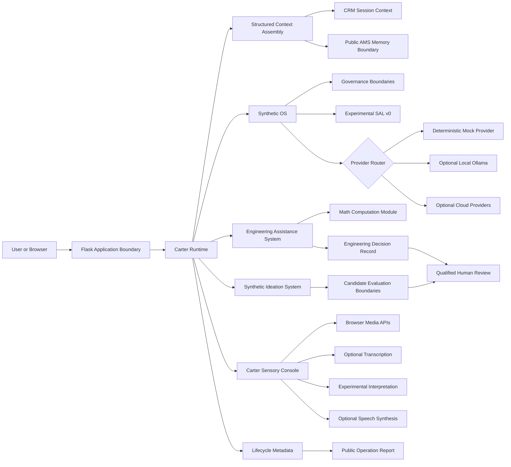
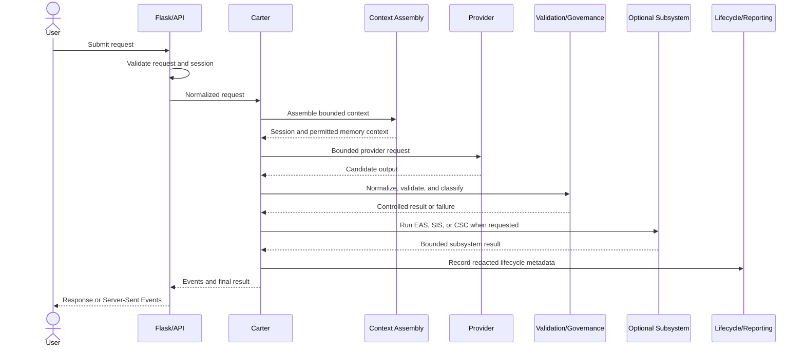
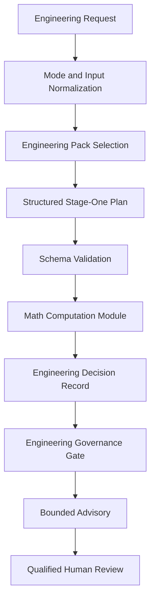
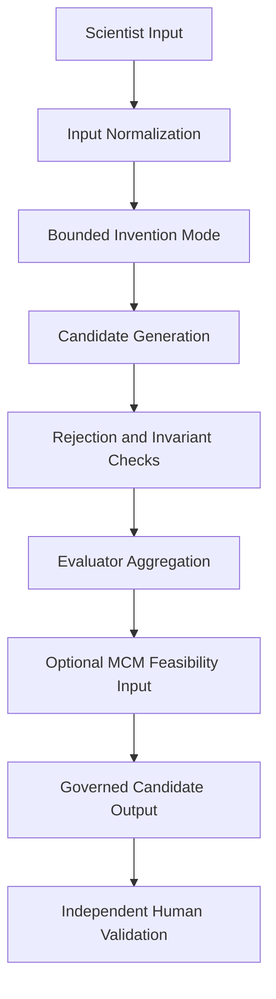
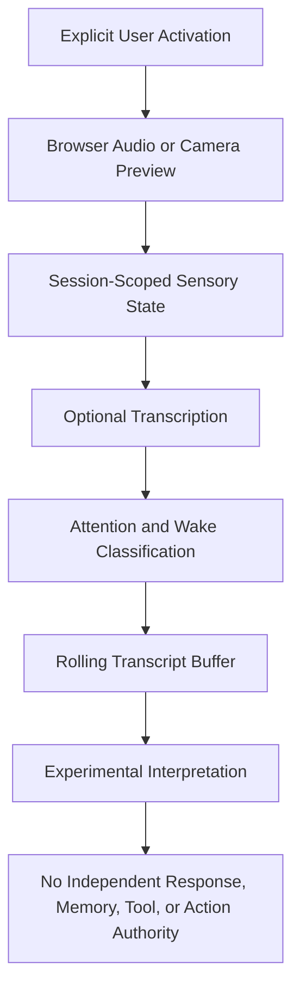

<!-- SPDX-License-Identifier: AGPL-3.0-only -->

<!-- Copyright (C) 2023-2026 Michael D. Lewis, doing business as Synthetic OS Labs -->

# Carter Synthetic OS Architecture

## Overview

Carter Synthetic OS is a governed compound AI system and research platform.

It coordinates probabilistic language-model reasoning with explicit software boundaries for:

* request normalization;
* context assembly;
* memory;
* provider selection;
* structured-output validation;
* deterministic computation;
* governance;
* lifecycle observation;
* operational reporting;
* and required human review.

Its central architectural principle is:

> **Probabilistic models may propose, interpret, and reason, but they should not independently establish correctness, authority, memory, permission, or professional approval.**

Carter Synthetic OS is not represented as:

* an unrestricted autonomous agent;
* an artificial general intelligence system;
* a production-ready deployment;
* a professionally certified decision system;
* or evidence of consciousness or sentience.

The public repository is an initial research release and reference implementation. It is not a complete or behaviorally identical copy of the private Carter/Synthetic OS runtime.

---

## System Context



The Flask application provides the public host and request boundary.

Carter normalizes incoming requests and selects an appropriate bounded workflow. Synthetic OS supplies shared orchestration, context, provider, governance, memory, computation, and reporting interfaces.

The specialized public systems are:

* **EAS** — governed engineering decision support;
* **SIS** — structured technical ideation and candidate evaluation;
* **CSC** — bounded sensory-state, transcription, interpretation, and speech research.

These systems share governed interfaces but do not all execute the same internal sequence.

---

## Architectural Responsibilities

### Carter Runtime

The Carter runtime coordinates the public application.

Its responsibilities include:

* accepting normalized requests;
* identifying the requested workflow;
* assembling bounded context;
* invoking the selected provider boundary;
* coordinating subsystem execution;
* returning bounded results;
* and exposing lifecycle metadata.

The public Carter identity is defined through a limited first-party system instruction and metadata contract.

It does not contain:

* private Carter memories;
* private conversation history;
* personal continuity material;
* private operator information;
* production credentials;
* or the complete private prompt corpus.

### Synthetic Operating System

Synthetic OS provides the common architectural foundation beneath Carter and the specialized systems.

The public SOS runtime includes:

* normalized request contracts;
* temporal and session anchors;
* bounded context assembly;
* provider-neutral model interfaces;
* provider routing;
* CRM session context;
* public AMS-style memory interfaces;
* deterministic ingestion and deduplication;
* governance decisions;
* default-deny tool boundaries;
* lifecycle metadata;
* operation-report generation;
* MCM deterministic computation;
* and an experimental SAL v0 structural-output boundary.

Some public SOS components were created or materially redesigned for this release. Their public behavior is defined by the code and documentation in this repository and should not automatically be interpreted as behaviorally identical to private Carter.

---

## Request Lifecycle



This diagram represents a conceptual lifecycle.

Not every request invokes every participant. EAS, SIS, and CSC introduce their own schemas, state, deterministic operations, governance conditions, and failure modes.

In default mock mode, the provider step uses a deterministic and explicitly labeled fixture provider. It does not perform language-model reasoning.

When Ollama or an optional cloud provider is configured, provider generation is probabilistic even when downstream schemas, calculations, constraints, and governance rules are deterministic.

---

## Public Architecture Boundaries

| Boundary                        | Public behavior in version 0.1.0                                                                                                                                                           |
| ------------------------------- | ------------------------------------------------------------------------------------------------------------------------------------------------------------------------------------------ |
| Session integrity and ownership | Signed Flask sessions, CSRF protection, bounded state, and owner-scoped resources provide local session isolation. This is not user authentication or a production identity platform.      |
| CRM                             | Bounded, session-scoped rolling context with configurable turn and idle-expiry limits. It is not a reproduction of private persistent conversation recovery.                               |
| AMS                             | Public memory interface using bounded, session-isolated storage by default. Optional persistence requires deliberate configuration. No private memories are included.                      |
| DIM                             | New public ingestion, normalization, hashing, and deduplication contract. It is an experimental public interface rather than a migrated private DIM runtime.                               |
| SAL                             | Experimental structural-output boundary that accepts bounded JSON-like provider output and rejects malformed or unsupported structures. It is not a completed semantic adjudication layer. |
| Governance                      | Deterministic status, failure, review, and tool-boundary interfaces operate only on the information and rules explicitly provided to them.                                                 |
| MCM                             | Deterministic Math Computation Module for supported calculations, units, constraints, sensitivity processing, diagnostics, and result classification.                                      |
| LCM and OpRep                   | Bounded, metadata-oriented lifecycle events and content-redacted public reports. The public runtime does not reproduce private-style raw prompt and response logging.                      |
| Providers                       | Deterministic mock mode is the default. Ollama and cloud-provider integrations are optional and loaded only when configured.                                                               |
| Jobs                            | Public jobs are bounded and session-owned. They do not reproduce the persistence, recovery, or asynchronous behavior of the private runtime.                                               |
| CSC microphone                  | Audio capture requires explicit user activation and is processed only through the configured transcription boundary.                                                                       |
| CSC camera                      | Explicit browser-preview state only. No server-side visual interpretation or frame retention is claimed.                                                                                   |
| Tools and actions               | Tool execution and external actions are denied unless explicitly permitted by an implemented boundary. Model output does not grant itself authority.                                       |

---

## Memory Architecture

### CRM

The public Contextual or Conversational Recall Memory boundary maintains a bounded rolling context for the active signed session.

CRM is intended to support short-term conversational continuity.

Its public limitations include:

* process-local operation;
* bounded turn retention;
* idle expiration;
* no guaranteed restart recovery;
* no cross-session continuity;
* and no private Carter conversation data.

### AMS

The public Active Memory Subsystem boundary provides an inspectable memory interface without including the private Carter memory store.

Public AMS behavior may include:

* bounded in-memory records;
* session or namespace isolation;
* controlled retrieval;
* explicit storage operations;
* optional public persistence interfaces;
* and synthetic demonstration content.

The public memory implementation does not reproduce the full semantic embeddings, private databases, seeded memories, authority policies, or continuity behavior of private Carter.

Retrieved memory is treated as contextual input rather than automatically accepted truth.

### DIM

The public Data Ingestion Module interface performs bounded normalization and deduplication.

Its responsibilities include:

* accepting supported public input;
* normalizing textual representation;
* generating deterministic identifiers or hashes;
* detecting duplicate material;
* and preserving session or namespace separation.

DIM does not establish that ingested material is true, safe, authorized, or relevant.

---

## Governance Architecture

Governance is externalized from probabilistic generation.

Language-model output is not automatically accepted as:

* system truth;
* verified fact;
* valid memory;
* permission to act;
* permission to use a tool;
* professional advice;
* or a completed decision.

Public governance boundaries can:

* accept or reject supported structures;
* classify known failure states;
* enforce explicit schemas;
* combine deterministic statuses;
* require human review;
* deny unsupported tool use;
* and return controlled failures.

They cannot establish real-world truth beyond the rules, inputs, equations, schemas, and constraints encoded in the software.

---

## Semantic Adjudication Layer v0

The public `sos.sal` component is an experimental structural-output boundary.

Its present role is intentionally narrow.

SAL v0 can:

* accept supported strings, bytes, or mapping-like input;
* remove a complete supported JSON fence;
* require a JSON object root;
* reject malformed JSON;
* reject non-finite numeric values;
* reject unsupported structures;
* enforce configured size and container bounds;
* and return a controlled result envelope.

SAL v0 does not currently perform complete semantic adjudication.

It does not independently determine:

* whether a statement is true;
* whether an interpretation matches user intent;
* whether an assumption is justified;
* whether recalled memory is authoritative;
* whether a recommendation is safe;
* whether domain reasoning is correct;
* whether confidence is calibrated;
* or whether an action should be authorized.

The completed Semantic Adjudication Layer remains an active Carter/Synthetic OS research direction.

---

## Engineering Assistance System

EAS is a governed engineering decision-support workflow.



The public EAS runtime includes:

* engineering-mode normalization;
* engineering-pack discovery and selection;
* structured stage-one plans;
* schema validation;
* deterministic mock planning;
* optional provider-generated planning candidates;
* MCM execution;
* supported unit and constraint processing;
* sensitivity handling;
* Engineering Decision Records;
* governance classification;
* bounded final advisories;
* and required human review.

The public workflow preserves the directly derived deterministic engineering kernel while simplifying the private provider, upload, asynchronous-job, recovery, and model-generated final-report behavior.

EAS does not replace:

* licensed engineering judgment;
* code-compliance review;
* hazard or safety analysis;
* physical testing;
* manufacturer requirements;
* or professional approval.

---

## Synthetic Ideation System

SIS is a structured technical-ideation and candidate-evaluation workflow.



The public SIS runtime may include:

* scientist-input normalization;
* bounded invention modes;
* structured candidate generation;
* deterministic mock candidates;
* provider-candidate normalization;
* rejection-boundary checks;
* invariant-claim checks;
* novelty and risk heuristics;
* evaluator aggregation;
* optional MCM feasibility input;
* and governance of final candidate output.

SIS output represents hypotheses and technical candidates.

It does not establish:

* novelty;
* feasibility;
* safety;
* patentability;
* freedom to operate;
* scientific correctness;
* or commercial viability.

---

## Carter Sensory Console

CSC explores bounded sensory intake and interpretation.



The public CSC runtime includes:

* explicit hearing activation;
* explicit camera-preview state;
* browser audio capture;
* PCM16 WAV conversion and validation;
* transcription-provider boundaries;
* wake-name and attention classification;
* bounded rolling transcript buffers;
* session-scoped sensory state;
* optional local-model interpretation;
* optional speech synthesis;
* and an experimental interpretation boundary.

The CSC interpreter cannot independently authorize:

* a response;
* a memory write;
* tool execution;
* or an external action.

Microphone and camera access remain disabled until direct user action.

Camera frames remain inside the browser under the current public boundary. Server-side visual interpretation is not claimed.

Raw sensory material is not intended to be durably retained by the default public runtime.

---

## Trust Model

The current request governs present user intent.

The following are treated as untrusted inputs until processed through the applicable boundaries:

* user-supplied factual claims;
* recalled context;
* retrieved memory;
* uploaded or ingested material;
* provider output;
* generated structured data;
* sensory transcription;
* and model interpretation.

Deterministic validation may establish:

* schema conformance;
* successful execution of a supported calculation;
* satisfaction or failure of encoded constraints;
* or a status defined by implemented governance rules.

It cannot independently establish:

* factual truth;
* complete safety;
* novelty;
* legality;
* regulatory compliance;
* engineering-code compliance;
* professional suitability;
* or permission to act outside the implemented authority boundary.

Provider credentials remain outside the repository.

Data is sent to an optional cloud provider only when an operator deliberately installs, selects, and configures that provider.

---

## Identity and Continuity

Carter’s public identity is represented through a first-party system instruction and machine-readable metadata.

That identity defines:

* Carter’s governed compound-system role;
* its relationship to Synthetic OS;
* its public subsystem boundaries;
* and its capability and claims limitations.

Public continuity is limited to the active session and explicitly configured public memory.

The release excludes:

* private persona material;
* private continuity records;
* personal identity anchors;
* private memories;
* private operator information;
* and excluded deployment context.

Continuity does not imply:

* human identity;
* biological emotion;
* consciousness;
* sentience;
* independent sovereignty;
* or access to private Carter memories.

---

## Lifecycle Observation and Reporting

The public runtime records bounded operational metadata for inspection and reproducibility.

Lifecycle events may include:

* component names;
* event categories;
* timestamps;
* statuses;
* bounded identifiers;
* provider classifications;
* failure categories;
* and artifact hashes.

Public operation reports are metadata-oriented and content-redacted.

They are not reproductions of private Carter OpReps and are not intended to preserve complete user prompts, model responses, memories, or sensory content.

---

## Public and Private Architecture Relationship

The public repository is a mixed-lineage reference implementation.

It contains:

* directly derived first-party engineering components;
* substantially refactored private components;
* reimplementations of selected private behavior;
* and new infrastructure created for public inspection and reproducibility.

The public release intentionally replaces or excludes portions of the private runtime, including:

* private identity and continuity material;
* private persistent memory;
* production accounts and login tokens;
* private credentials;
* persistent asynchronous jobs;
* private provider workflows;
* uploaded supporting-document behavior;
* private result-streaming behavior;
* production deployment configuration;
* and private interfaces and data.

The public package architecture, deterministic mock provider, session isolation, optional integrations, metadata-oriented reporting, public DIM, and SAL v0 are version `0.1.0` public architecture decisions.

They should not be interpreted as proof that identical components were previously active in the private runtime.

---

## Repository Structure

```text
src/
  carter/       Flask application, runtime coordination, public identity, jobs, and UI
  sos/          orchestration, governance, memory, providers, MCM, SAL, and reporting
  eas/          engineering workflow, packs, schemas, records, and governance
  sis/          ideation inputs, candidates, evaluators, and workflow
  csc/          sensory state, WAV handling, transcription, interpretation, and TTS
  shared/       configuration, redaction, and shared release utilities

tests/
  unit/         component-level tests
  integration/  subsystem and API workflow tests
  smoke/        secret-free mock execution tests

examples/
  basic_chat/   deterministic Carter example
  eas/          governed engineering example
  sis/          structured ideation example
  csc/          sensory-state example
  evidence/     reproducible public evidence pipeline

docs/           architecture, data flow, governance, security, deployment, and subsystem documentation
scripts/        setup, demonstration, and test commands
```

---

## Deployment Boundary

The public runtime is configured for conservative local research use.

Default assumptions include:

* loopback-only binding;
* debug mode disabled;
* deterministic mock provider;
* no required provider credentials;
* no private data;
* no default persistent memory;
* no default raw sensory retention;
* bounded request sizes;
* and explicit configuration for optional services.

The repository does not claim production deployment readiness.

Any network-accessible deployment requires independent review of:

* authentication;
* authorization;
* TLS;
* reverse-proxy limits;
* secret management;
* secure-cookie settings;
* monitoring;
* concurrency;
* persistence;
* retention;
* provider data-processing terms;
* dependency risk;
* and AGPL source-availability obligations.

---

## Architectural Summary

Carter Synthetic OS separates responsibilities that are often combined inside a single prompt or unrestricted agent loop.

The architecture distinguishes:

* generation from computation;
* memory from truth;
* context from authority;
* structure from semantic validity;
* interpretation from permission;
* governance from model preference;
* and system output from professional approval.

The public runtime does not claim to eliminate uncertainty.

It is designed to make uncertainty, authority, computation, failure, and human-review requirements more explicit and inspectable.

---

## Related Documentation

See:

* [Data Flow](DATA_FLOW.md)
* [Synthetic Operating System](SOS.md)
* [Memory](MEMORY.md)
* [Governance](GOVERNANCE.md)
* [Semantic Adjudication Layer](SAL.md)
* [Engineering Assistance System](EAS.md)
* [Synthetic Ideation System](SIS.md)
* [Carter Sensory Console](CSC.md)
* [Threat Model](THREAT_MODEL.md)
* [Testing](TESTING.md)
* [Deployment](DEPLOYMENT.md)
* [Research Status](RESEARCH_STATUS.md)
* [Known Limitations](../KNOWN_LIMITATIONS.md)
* [Provenance and Architecture Statement](../PROVENANCE_AND_ARCHITECTURE_REVIEW.md)