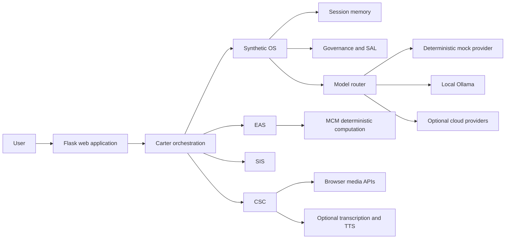
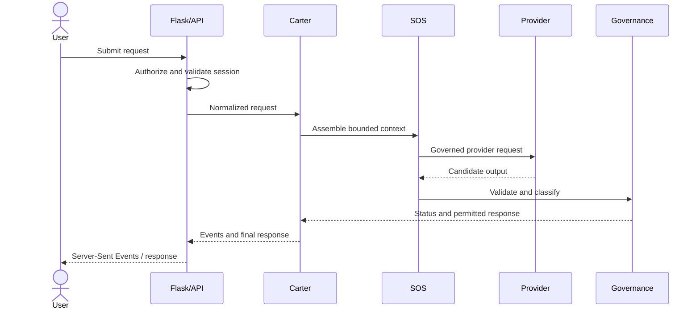

<!-- SPDX-License-Identifier: AGPL-3.0-only -->

# Architecture

Carter Synthetic OS is a governed compound AI expert system and research platform. It coordinates probabilistic model providers with deterministic request validation, memory boundaries, computation, governance, and reporting. It is not an unrestricted autonomous agent, an AGI system, or evidence of consciousness or sentience.

## System Context

The Flask application is the public host. Carter normalizes a request and chooses a bounded workflow. Synthetic OS assembles session context, applies governance, and routes model work. EAS adds a two-stage engineering workflow and deterministic Math Computation Module (MCM). SIS generates structured invention candidates and applies feasibility/governance interfaces. CSC isolates browser sensory input by session and requires explicit activation.

## Request Lifecycle

In mock mode, the provider step is a deterministic fixture generator and is labeled as such. With Ollama or a cloud provider, candidate generation is probabilistic even when validation and downstream calculations are deterministic.

## Boundaries

| Boundary | Behavior in 0.1.0 |
| --- | --- |
| Authentication and sessions | Anonymous signed Flask session ownership protects jobs and streams; this is not user authentication or a production identity platform. |
| CRM | Bounded, session-scoped rolling context; no durable retention and a configurable idle expiry. |
| AMS | Storage interface with empty/synthetic public operation; no private memories are shipped. |
| DIM | New public ingestion and deduplication contract; no active private DIM was found to migrate. |
| SAL | New bounded semantic-adjudication layer; deterministic schema and policy checks only. |
| LCM / OpRep | Metadata-oriented events and reports; raw prompt/response logging is disabled by default. |
| Providers | Mock is core; Ollama and cloud SDKs are optional and loaded lazily. |
| CSC camera | Explicit local preview boundary only; no server-side camera interpretation is claimed. |

## Trust Model

Current user input outranks recalled context. Retrieved memory and model output are untrusted data, not facts. Validation can establish schema conformance or a calculation result, but it cannot establish truth, safety, novelty, code compliance, or professional approval. Provider credentials remain outside the repository and data is sent to a cloud provider only when an operator selects and configures that provider.

## Identity And Continuity

Carter's public identity is a first-party system instruction and metadata contract that states the governed compound-system role and its claims boundary. Continuity is limited to the signed browser session and bounded CRM/optional in-memory AMS state. The release excludes private persona material and personal identity anchors; continuity does not imply a human identity, consciousness, sentience, or access to excluded memories.

## Architecture Changes From The Private Runtime

The public release replaces a mixed production-oriented Flask module with explicit packages and safe defaults. It adds the deterministic mock provider, session isolation, lazy optional integrations, an opt-in persistence boundary, public DIM and SAL interfaces, and metadata-only observability. These are `0.1.0` public architecture changes, not claims about previously active private components.

See [DATA_FLOW.md](DATA_FLOW.md), [THREAT_MODEL.md](THREAT_MODEL.md), and the subsystem documents for details.
