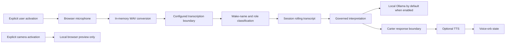

<!-- SPDX-License-Identifier: AGPL-3.0-only -->

# Carter Sensory Console

Carter Sensory Console (CSC) is a session-isolated interface for optional audio input, transcription, sensory classification, interpretation, and text-to-speech. Its browser media controls are disabled by default and require explicit user action.

## Pipeline

No microphone, camera, raw audio, or frame capture starts on page load. The interface must display whether listening, transcription, interpretation, TTS, or camera preview is active.

## Sensory Roles

Transcripts can be classified as:

- **focused**: directed to Carter in the current interaction;
- **peripheral**: potentially relevant surrounding speech;
- **ignored**: content excluded by deterministic classification or user state;
- **background**: ambient transcript retained only in the bounded session buffer when allowed.

Wake-name detection is a deterministic text classification aid, not biometric voice identification. It can miss, misclassify, or receive incorrect transcription and must not be used as an authorization mechanism.

## Audio And Transcription

The browser captures audio only after a user gesture and converts supported recordings to an in-memory WAV payload at the transcription boundary. Raw audio is not retained by default. Size, duration, format, and session checks apply before processing.

Cloud transcription sends audio to the configured provider. In the supported Google integration, this means audio leaves the local machine and is processed under the operator's provider account and terms. Do not enable it without user notice, lawful authority, and an appropriate privacy policy. Provider dependencies and credentials are optional.

## Interpretation

Interpretation is isolated from transcription. A configured local Ollama service can receive bounded transcript context and return structured interpretation JSON. The normalization layer rejects malformed output and preserves explicit unknown states. If Ollama is unavailable, CSC reports an unavailable-provider state rather than fabricating an interpretation.

Rolling transcript and latest interpretation state are keyed to the active session. Cross-session access is prohibited. Explicit reset removes the state immediately; otherwise the in-process state expires after 3600 seconds of inactivity by default or at process exit. Browser-close cleanup is best effort. Durable sensory retention is unavailable in `0.1.0`, and configuration attempts to enable it are rejected.

## Text To Speech And Voice Orb

TTS is optional. ElevenLabs configuration, including `ELEVENLABS_API_KEY` and `ELEVENLABS_VOICE_ID`, is supplied by the operator and is never included in the repository. Text sent to that provider leaves the local system. No cloned voice sample, voice identifier, or generated private audio is distributed.

The voice orb is a visual state indicator, not evidence of emotion, awareness, or cognition. It should reflect idle, listening, processing, and speaking states without concealing whether capture is active.

## Camera Boundary

The audited private tree contained no camera implementation. The `0.1.0` public boundary is limited to an explicit browser-local preview, disabled by default. The release does not claim server-side image capture, storage, model interpretation, recognition, or camera-derived memory.

## Privacy And Security Requirements

- Require an explicit user gesture for every media-device activation.
- Show a persistent active-state indicator and provide an immediate stop control.
- Keep sensory data session-scoped and non-retained by default.
- Never place session credentials in URLs or browser persistent storage.
- Treat transcripts and provider interpretations as untrusted input.
- Do not use wake-name detection as authentication or consent.
- Disclose the selected provider and cloud transfer before capture.
- Apply browser permissions, HTTPS requirements outside loopback, CSRF protection, size limits, and rate limits appropriate to deployment.

CSC is a research interface, not a surveillance, emergency-response, accessibility-certification, medical, or safety monitoring system.
