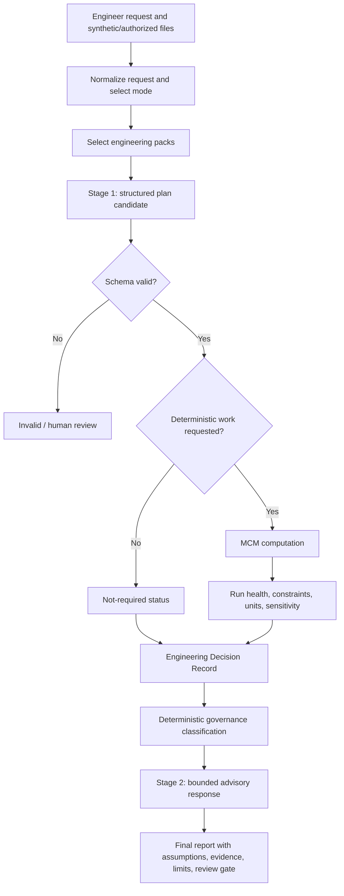

<!-- SPDX-License-Identifier: AGPL-3.0-only -->

# Engineering Assistance System

> **Professional-review requirement:** EAS is engineering decision-support software. It does not replace licensed engineering judgment, applicable-code review, hazard and safety analysis, field verification, or professional approval. Every `0.1.0` result requires qualified human review.

EAS combines structured model-assisted planning with deterministic calculation and rule-based governance. It preserves assumptions, unknowns, evidence references, and review requirements rather than presenting model prose as an engineering certification.

## Public Modules

| Module | Responsibility |
| --- | --- |
| `eas.modes` | Normalize the requested engineering mode. |
| `eas.schemas` | Validate stage-one plans and workflow inputs. |
| `eas.packs` | Select bounded first-party engineering guidance packs. |
| `eas.decision_record` | Build a compact Engineering Decision Record (EDR). |
| `eas.governance` | Classify computation and review status. |
| `eas.workflow` | Coordinate both stages through `EngineeringWorkflow.run`. |
| `sos.computation.mcm` | Execute supported deterministic plans through `process`. |

## Modes

- `solve-problem`: size, calculate, select, or propose a bounded answer.
- `diagnose-root-cause`: compare observed symptoms and candidate causes.
- `review-design`: evaluate declared criteria, margins, and missing evidence.
- `suggest-improvements`: develop and screen improvements to an existing system.
- `explore-novel-solution`: explore distinct engineering candidates with feasibility limits.

Mode selection shapes the plan and pack selection. It does not relax review requirements.

## Two-Stage Workflow



With no provider supplied, the stage-one plan and stage-two advisory are deterministic fixtures and clearly identify the mock backend. With an optional model provider, only the proposed stage-one plan is probabilistic. Stage two is assembled from validated plan, MCM, EDR, and governance data; provider output never decides governance status. Schema validation, supported MCM work, EDR construction, advisory assembly, and governance classification remain deterministic for a fixed input and software version.

## Current Private Implementation Comparison

The active private EAS interface uses the v2 server workflow. That path
preselects engineering packs, runs a model activation using a PGM-assembled
prompt for the stage-one plan, parses and validates the result, invokes MCM
when requested, builds the EDR/governance/evidence records, and then runs a
second model activation using a PGM-assembled prompt for the final report
before report sanitation and persistence.
The private second stage is therefore probabilistic; it is not the deterministic
public advisory renderer described above. Older EAS routes remain in the private
server but are legacy paths, not the current UI target.

## Stage-One Plan

Stage one expresses the work as structured data rather than free-form executable instructions. Depending on mode and problem, it can identify:

- known inputs, units, assumptions, and unknowns;
- requested computations and dependencies;
- constraints and acceptance criteria;
- screening or selection candidates;
- sensitivity variables where supported;
- risk and human-review indicators.

The schema rejects malformed plans. A plan is not executed as Python or shell code. Only supported MCM operations and expressions pass into the deterministic engine.

## MCM

MCM supports bounded arithmetic and dependency-ordered calculations, unit handling, constraints and margins, screening/selection, diagnostic summaries, and sensitivity analysis where implemented by the requested plan. Unsupported operations, unit conflicts, missing values, and invalid dependencies remain explicit in run health.

A repeatable numeric result proves only that the included algorithm produced that value from the validated inputs. It does not prove the inputs, formula choice, physical model, boundary conditions, or acceptance criteria are suitable.

## Engineering Packs

Packs supply scoped guidance for a mode or domain. They are selected as context, not executed as code and not treated as adopted standards. Inclusion does not imply endorsement by a standards body or completeness for a discipline. Before public release, a human must confirm the authorship and provenance of every included pack.

## EDR And Governance

The Engineering Decision Record captures decision-relevant inputs, computed outputs, assumptions, unknowns, constraints, evidence references, and review disposition. The deterministic gate classifies the result into bounded families such as computed, criteria failed, no viable option, diagnostic, partial, unsupported, review required, error, or unknown.

All public `0.1.0` results set the outer `governance_status` to `needs_human_review`. The underlying rule result remains available as `deterministic_gate_status` for traceability; it is not an approval. High-risk, ambiguous, unsupported, partial, or error outcomes must not be described as approved designs.

## Output Contract

The canonical JSON-safe result includes `stage_one_plan`, `schema_validation`, `mcm`, `governance`, `engineering_decision_record`, and `advisory`. Compatibility aliases expose the same bounded data as `structured_plan`, `validation`, `computation`, and `final_response`. Consumers should prefer the canonical fields and must honor `human_review_required`.

## Programmatic Use

```python
from eas.workflow import EngineeringWorkflow

result = EngineeringWorkflow().run(payload)
```

The zero-provider path uses deterministic mock fixtures. An optional provider may be supplied through the workflow's provider boundary. Returned data is JSON-safe and includes workflow status rather than raising away expected validation/governance outcomes.

## Validation Status

| Claim | Status for 0.1.0 |
| --- | --- |
| Workflow, schema, MCM, EDR, and governance code is present | Implemented. |
| Included behavior has repository tests | Tested to the extent reported in the release report; review exact results there. |
| General engineering accuracy across disciplines | Not independently validated. |
| Production validation or regulatory qualification | Not claimed. |
| Suitability for a real engineering decision | Requires independent professional review. |

Do not use EAS as the sole basis for safety-critical, regulated, construction, manufacturing, medical, aerospace, electrical, pressure-system, or other consequential decisions.
