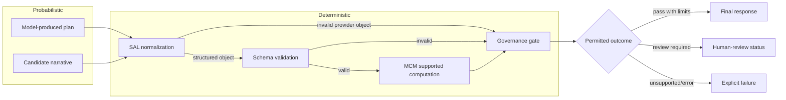

<!-- SPDX-License-Identifier: AGPL-3.0-only -->

# Governance

Governance constrains how Carter turns untrusted inputs and probabilistic candidates into user-facing output. It does not make model output true and does not replace a qualified reviewer.

## Packaged EAS/SIS Provider Control Flow

The shaded conceptual boundary is important: deterministic processing can validate the shape of a probabilistic plan and recompute supported values, but it cannot validate every premise or claim in generated prose.

In the packaged Flask runtime's non-mock EAS/SIS provider path, SAL is a
structural JSON-object boundary before workflow schema validation. It is not
called after MCM and does not semantically approve MCM results. Mock workflows
bypass that provider SAL call and apply their workflow schemas directly.
Library callers that invoke `EngineeringWorkflow` or `IdeationWorkflow` with a
provider directly must supply an appropriate structured-provider boundary;
those workflow classes do not themselves invoke `sos.sal`.

## Current Private PGM Governance

The current private Prompt Governance Module (PGM) retrieves AMS/RAG context
and assembles a large provider prompt containing policy and architectural
instructions. Those instructions are interpreted probabilistically by the
selected language model. Named PGM sections such as SDCM express model-facing
governance responsibilities through prompt construction. They are distinct
from separately implemented deterministic Python enforcement.

Private executable enforcement remains distributed: the Flask host performs
authentication, authorization, route, and resource-ownership checks, while EAS
performs schema validation, MCM computation, EDR construction, and
deterministic engineering governance. See [PGM.md](PGM.md).

The current private PGM revision also addresses emergency claims and
consequential tool actions. Its public-safe architectural effect is limited:
asserting an emergency does not verify it, and a model instruction cannot grant
tool authority. Applicable authorization, validation, allowlisting, and host
controls remain necessary before consequential action.

## Inputs To A Decision

A governance decision can consider:

- workflow and requested mode;
- validation result;
- deterministic computation status and run health;
- missing or ambiguous inputs;
- constraint and selection outcomes;
- declared risk class;
- evidence references and unresolved assumptions;
- explicit human-review triggers.

`GateDecision` communicates status, reason, and review requirements in a form callers can display and test.

## Status Semantics

Workflow-specific statuses may distinguish computed success, failed criteria, no viable option, diagnostic result, partial output, unsupported computation, review required, system error, or unknown state. A status is scoped to the checks actually performed. For example, "computed criteria passed" does not mean a design satisfies every law, code, hazard, or field condition.

Unknown, partial, unsupported, and error states must remain visible. Callers must not silently coerce them to success. High-risk engineering decisions remain review-gated even when supported deterministic checks pass.

## Tool Boundary

The tool boundary is allowlisted and deny-by-default. Tools must be registered explicitly, receive validated structured arguments, and return bounded structured results. Tool names or arguments originating in model output are untrusted until validated. Credentials and filesystem/network authority should remain outside model-visible data.

The included boundary is an application control, not an operating-system sandbox. Deployments that add powerful tools need separate process isolation, least-privilege credentials, egress policy, timeouts, quotas, and audit review.

## Evidence And Traceability

Governed workflows retain status, backend class, validation/computation summaries, and artifact hashes sufficient for the included evidence case. They do not imply that every model inference is reproducible. A probabilistic provider may produce different text across calls even with the same visible request.

## Human Review

EAS always remains engineering decision-support software. Licensed engineering judgment, code compliance, safety analysis, field verification, and professional approval are outside the software's authority. SIS outputs are hypotheses or candidates requiring technical validation, prior-art and patent analysis, safety review, and experiment.

## Non-Goals

Governance does not provide unrestricted autonomy, legal compliance certification, patent clearance, safety certification, or scientific validation. It does not defend against a malicious host administrator or eliminate all prompt-injection and supply-chain risks.
