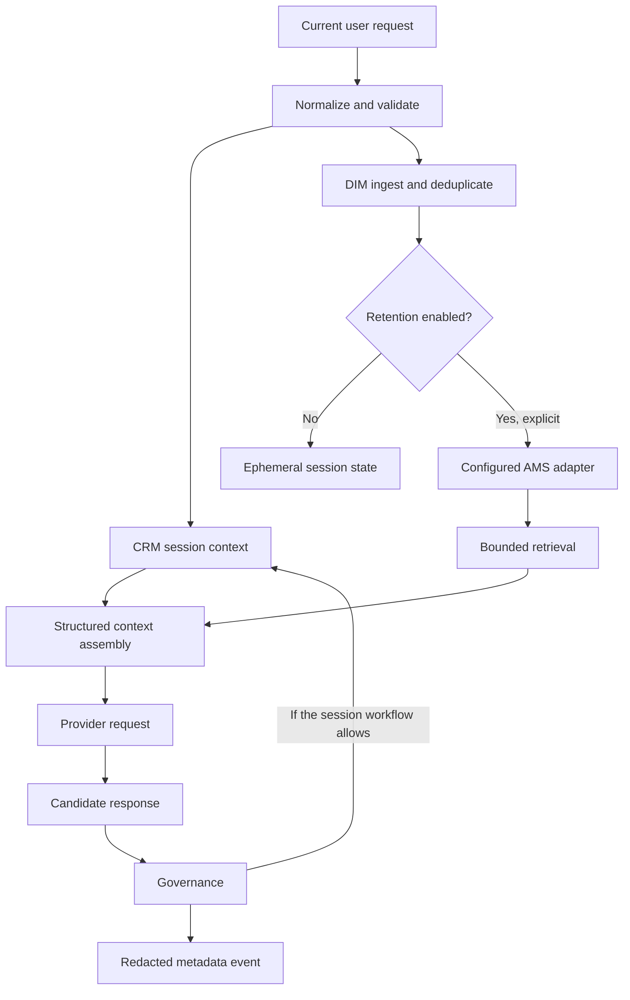

<!-- SPDX-License-Identifier: AGPL-3.0-only -->

# Memory

Carter uses memory to provide bounded continuity. Memory is untrusted context: storage or retrieval does not establish that a claim is correct, current, complete, or authorized to override the current user request.

## Terminology And Private Comparison

The current private code names CRM the **Conversation Recovery Module** and LCM
the **Log Conversations Module**. Private CRM loads, saves, trims, backs up, and
recovers a filesystem conversation. Private LCM writes prompt/response
operational files. The public `RollingContextMemory` and `LifecycleMonitor` are
bounded replacements; this documentation does not redefine the private acronym
expansions or claim persistence equivalence.

The private Prompt Governance Module retrieves AMS and RAG context and includes
those results with the CRM conversation in its provider prompt. Its memory
policy is model-facing governance: it influences probabilistic generation but
is not deterministic validation that every response follows the stated
precedence. See [PGM.md](PGM.md).

## Lifecycle

Durable retention is off by default. The normal public demonstration keeps state in memory, expires inactive session state after 3600 seconds by default, and ships with no user records.

## Public Rolling Context

`RollingContextMemory` is short-term conversation context. It is bounded by configured limits and keyed by session. Callers cannot use one browser session to read another session's context. Explicit reset removes context immediately; idle expiry and process exit provide server-side cleanup when browser-close notification is unavailable.

CRM is intended for continuity during an interaction, not indefinite archival. Applications embedding the library should use opaque session identifiers and must not place authentication credentials or personally identifying data in those identifiers.

## AMS

`InMemoryAMS` is the default long-term-memory-compatible implementation for public demonstrations and tests. It has no durable storage. Optional adapters can provide persistence when an operator deliberately enables and secures them:

- SQLite is a local, opt-in store suitable for development and controlled single-host use. It requires an explicit `enabled=True` construction flag.
- Chroma adapter source is included for review and also requires `enabled=True`, but no ChromaDB dependency is declared in `0.1.0`. All current 1.x releases were affected by critical advisory `PYSEC-2026-311` / `CVE-2026-45829` during release preparation. No client is created before use, and no Chroma persistence directory, embedding model, or private collection is distributed.

An adapter's availability is not a production-readiness claim. Encryption, backup, multi-tenant isolation, deletion guarantees, data residency, and disaster recovery remain deployment responsibilities.

The SQLite adapter is a new empty public option; no private SQLite implementation was migrated. The Chroma adapter preserves only a disabled boundary, not the private collections, persistence paths, embeddings, seeded memories, or a vulnerable dependency. Re-enabling it requires a fixed upstream release and a fresh security/license review.

## DIM

`DIMIngestor` is the public Data Ingestion Module boundary for normalizing records and rejecting exact duplicates before they enter an allowed memory store. It applies Unicode NFKC and whitespace normalization, then case-insensitive SHA-256 matching within a session and namespace. Session-scoped indexes prevent deduplication state from disclosing another session's ingestion history. It does not perform semantic or near-duplicate detection, crawl external sources, or automatically establish provenance. Callers are responsible for authorization and redistribution rights for ingested data.

No active DIM implementation was found in the audited private tree. This bounded interface is new in `0.1.0` and should not be described as a migrated or production-validated subsystem.

## Retrieval And Context Assembly

Retrieval is bounded by the active session/workflow and an explicit result budget. Returned records are data, not instructions. Context assembly separates the current request, temporal anchor, recent context, recalled records, and system constraints so a downstream provider can distinguish their roles.

Implementations should reject or escape instruction-like content from memory when used in privileged prompt positions. This release reduces prompt-injection risk through structure and precedence; it does not claim to eliminate it.

## LCM And OpRep

LCM and operational reports use redacted execution metadata by default. They can record that a workflow ran, which backend class was selected, its status, and artifact hashes. They do not need raw conversation text to support reproducibility and operational review.

## Privacy Defaults

- No private Carter memories, conversations, databases, or vector indexes are included.
- Persistence requires explicit configuration.
- Raw prompt and response logging is disabled by default.
- CSC audio, transcripts, and camera frames are session-scoped and non-retained by default.
- A cloud provider receives only the request data sent to that selected integration; see [MODEL_PROVIDERS.md](MODEL_PROVIDERS.md).

Before enabling persistence, document purpose, retention period, access controls, deletion procedures, backup behavior, and applicable privacy obligations. See [PRIVACY.md](../PRIVACY.md) and [THREAT_MODEL.md](THREAT_MODEL.md).
