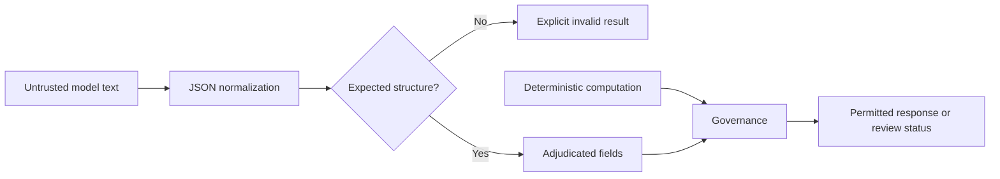

<!-- SPDX-License-Identifier: AGPL-3.0-only -->

# Semantic Adjudication Layer

SAL is a bounded public interface for normalizing and adjudicating structured candidate output. The audited private tree did not contain a standalone active SAL module. The `sos.sal` implementation is new in `0.1.0` and is deliberately limited.

## Responsibilities

SAL can:

- extract and normalize expected JSON-like output;
- reject malformed or structurally unsupported values;
- preserve explicit unknown and missing states;
- produce a structured adjudication result for governance;
- separate model-provided fields from deterministic results.

SAL does not:

- prove that natural-language claims are true;
- infer patentability, safety, or code compliance;
- replace MCM calculations or workflow-specific schema validation;
- execute arbitrary model-requested tools;
- turn a probabilistic output into a scientifically validated result.

## Boundary

Normalization must not invent omitted required values. Recovery may remove transport wrappers or select an already-present structured object; it must preserve uncertainty and report failures.

## Security Considerations

SAL treats candidate text as data. It does not evaluate Python, shell commands, templates, or arbitrary expressions. Size limits and schema constraints belong at every input boundary. A caller should log only redacted status metadata, not the full candidate payload, unless an operator has established a separate lawful retention policy.

## Research Status

The layer is implemented as a public contract and covered by bounded tests. It has not been independently validated as a general semantic-truth engine, because it is not intended to be one. See [RESEARCH_STATUS.md](RESEARCH_STATUS.md).
