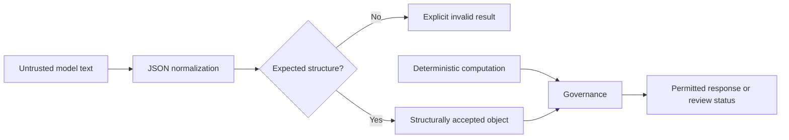

<!-- SPDX-License-Identifier: AGPL-3.0-only -->

# Semantic Adjudication Layer

SAL is the project name for a bounded public interface whose current code
normalizes and structurally validates one JSON object. The name **Semantic
Adjudication Layer** describes broader architectural intent; the `0.1.0`
implementation does not perform general semantic adjudication. The audited
private tree did not contain a standalone active SAL module. `sos.sal` is new
public code and is deliberately limited.

## Responsibilities

SAL can:

- parse a JSON object or remove one enclosing Markdown JSON fence;
- reject malformed or structurally unsupported values;
- reject missing caller-declared required fields;
- enforce configured payload-size, nesting-depth, and collection-size bounds;
- return a structured validity result for workflow schema validation or
  governance.

SAL does not:

- prove that natural-language claims are true;
- infer patentability, safety, or code compliance;
- replace MCM calculations or workflow-specific schema validation;
- execute arbitrary model-requested tools;
- turn a probabilistic output into a scientifically validated result.

## Boundary

Normalization does not invent omitted required values, repair malformed JSON,
or extract an object from surrounding prose. Its only text repair is removal of
one enclosing Markdown JSON fence. Workflow-specific schemas and governance
must still interpret the returned object.

## Runtime Integration

The packaged Flask runtime calls `normalize_json` through its non-mock EAS/SIS
provider adapter before workflow-specific schema validation. The Carter chat
path, CSC interpretation path, memory components, MCM, and generic SOS
orchestration do not call `sos.sal`. Mock EAS/SIS workflows also bypass SAL and
use deterministic fixtures plus their workflow schemas.

`EngineeringWorkflow` and `IdeationWorkflow` accept provider objects directly
as a library interface. A caller using that interface must provide structured
objects or an equivalent boundary; the workflow classes do not call SAL on the
caller's behalf.

## Security Considerations

SAL treats candidate text as data. It does not evaluate Python, shell commands, templates, or arbitrary expressions. Size limits and schema constraints belong at every input boundary. A caller should log only redacted status metadata, not the full candidate payload, unless an operator has established a separate lawful retention policy.

## Research Status

The layer is implemented as a public contract and covered by bounded tests. It has not been independently validated as a general semantic-truth engine, because it is not intended to be one. See [RESEARCH_STATUS.md](RESEARCH_STATUS.md).
