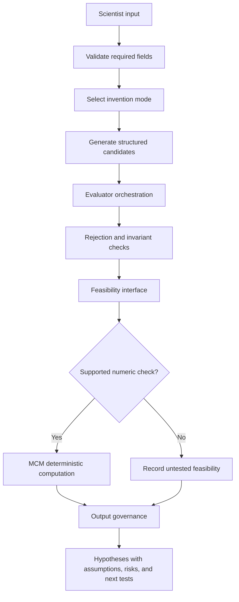

<!-- SPDX-License-Identifier: AGPL-3.0-only -->

# Synthetic Ideation System

> **Candidate-output warning:** SIS outputs are hypotheses or invention candidates. They require independent technical validation, prior-art review, patent analysis, safety assessment, and experimental confirmation.

SIS turns a structured exploration request into governed concept candidates. It provides disciplined framing and evaluation interfaces; it does not determine novelty, patentability, freedom to operate, feasibility, safety, or scientific truth.

## Public Modules

`sis.workflow.IdeationWorkflow.run` coordinates input validation, mode selection, candidate generation, evaluator aggregation, feasibility interfaces, optional MCM checks, and output governance. Supporting modules define modes, schemas, evaluator/rejection contracts, scoring, and workflow state.

The zero-provider path uses deterministic, synthetic mock fixtures and is labeled accordingly. When an optional provider is supplied, candidate generation is probabilistic. Deterministic checks remain separate and never establish novelty or patentability.

## Scientist Input

A request identifies an exploration vector, target domain, objective, allowed approaches, and rejection conditions. Optional controls can supply a forcing function, structural lens, discovery mode, causal-necessity condition, or prior-art-collapse pattern. These inputs frame the search; they are not evidence that a generated concept satisfies the requested properties.

## Modes

- `mechanism-discovery`
- `system-architecture`
- `process-innovation`
- `algorithmic-method`
- `hybrid-system-development`
- `constraint-inversion`

Constraint inversion treats a declared limitation as a prompt for a different mechanism, process, architecture, or method. It does not waive physical or safety constraints.

## Workflow



The audited private SIS route did not call MCM or the separate NPAM/IVA/CIT helper. Evaluator and MCM coordination in this repository is a public `0.1.0` architecture change, not evidence that those integrations were active in the private runtime.

## Evaluators And Feasibility

Evaluator results are structured opinions or heuristics over candidate fields. Rejection checks can identify a declared prohibited pattern or missing invariant. Feasibility interfaces can request a bounded calculation when inputs and an implemented MCM operation are available. Unsupported questions remain untested rather than being converted to invented evidence.

Scores rank candidates only under the included rubric and inputs. They do not measure absolute novelty, commercial value, scientific validity, patentability, or safety.

## Output Governance

Output should identify:

- the candidate and operating mechanism;
- dependencies and assumptions;
- known constraints and unresolved questions;
- evaluator and deterministic-check results, with provenance;
- hazards and failure modes identified by the workflow;
- proposed experiments or analysis needed next;
- explicit legal, prior-art, patent, safety, and professional-review requirements.

An accepted candidate carries `hypothesis_requires_independent_review`; a blocked candidate carries `rejected`. Prior-art, patent, and safety status remain `not_assessed`, and experimental status remains `not_validated`. SIS must not represent a model-generated citation, prior-art assertion, or experimental result as verified unless an independent process actually verified it.

## Programmatic Use

```python
from sis.workflow import IdeationWorkflow

result = IdeationWorkflow().run(payload)
```

The returned dictionary is JSON-safe and records backend and governance status. No standard run requires a cloud account.

## Limits

The release includes no patent-search engine and no active prior-art clearance module. It distributes no private vector templates, private prompts, experimental datasets, or confidential invention records. Any real research or patent workflow needs qualified domain, safety, and legal reviewers.
